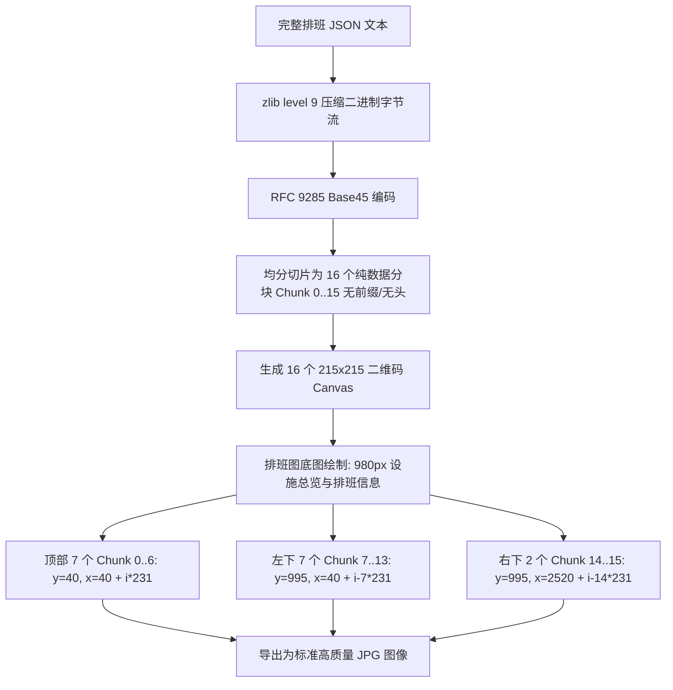
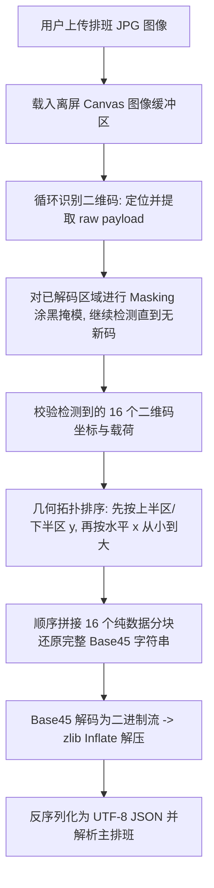

# Mower 排班工作台兼容移植设计（主排班核心版）

日期：2026-09-02（更新：2026-09-06）

目标分支：`mode/shift-run`

状态：User-approved scope

## 1. 目标与设计原则

在跑单版基建收益计算器中建立一套高保真复刻 Mower 排班页外观与核心交互的主排班工作台（Main Roster Workbench）。本期聚焦于**主排班（MAIN roster）的核心外观与功能**，让熟悉 Mower 的用户能够无缝进行设施排班、干员选择、替补与分组配置，以及双向互通 Mower 格式数据（JSON 与 16 二维码 JPG），同时保持现有收益计算引擎零改动。

### 核心原则
1. **纯主排班高保真复刻**：视觉布局、设施网格、干员选择、操作手感严格对齐 Mower 排班主界面，不做主观臆断与多余重构。
2. **算法完全隔离与纯适配**：坚决不修改 `calculate.ts`、`morale.ts`、`operatorRules.ts` 以及跑单轮换逻辑。工作台主排班通过纯函数适配器编译为既有 `AppConfig`（schema v7），直接驱动现有计算。
3. **无损兼容信封（Lossless Envelope）**：导入的 Mower 复杂排班中包含的顶层副排班（`backup_plans`，含其专有的 `free_blacklist` 等配置）、触发器（triggers）、任务覆盖（task overrides）及未识别顶层字段全部封装至兼容信封内原样保存；导出时完整回填，但在本阶段不赋予 UI 编辑或计算语义。
4. **确定性数字解析与精确 Mower 协议对齐**：排班图（JPG）导入导出严格遵从 Mower 官方 `arknights_mower/utils/qrcode.py` 规范（zlib 级别 9 压缩 + Base45 编码，切分为 16 个顺序纯数据分块，按顶部 7 个、左下 7 个、右下 2 个布局排布；导入通过循环识别并掩模定位、按上下半区及水平 X 坐标排序拼接还原），绝不发明自定义协议头，绝不采用固定网格切图解码，坚决不采用任何 OCR 图像识别。
5. **开源合规与稳定边界**：复制或参考的 Mower 代码片段完整保留 MIT 许可证声明与署名（`Copyright (c) 2021 Nano`）。标准分支（`mode/standard`）保持完全隔离与零变动。

## 2. 范围与明确非目标

### 2.1 本期范围（In Scope）
- **980px 三列式基建主画板**：左侧 3×3 产出设施（`room_1_1` 至 `room_3_3`）、中列控制中枢（`central`）与 4 间宿舍（`dormitory_1` 至 `dormitory_4`）、右列会客室（`meeting`）、加工站（`factory`）、办公室（`contact`）、训练室（`train`）及活动室（`gaming_1`..`3`）。
- **产出设施拖拽对调（Room Drag-Swap）**：产出设施之间支持自由拖拽对调位置，位置、类型、等级、产物、席位人员及替补原子同步交换。
- **选中设施即时编辑（Selected-room Editing）**：点击任一设施卡片在面板中即时编辑其类型、产物、等级与干员席位。
- **设施类型 / 产物 / 等级编辑**：支持制造站（赤金/作战记录/源石碎片）、贸易站（贵金属/源石订单）、发电站切换，以及等级编辑（1~3 级，宿舍 1~5 级）。
- **特殊席位语义支持**：支持干员（Operator）、`Free`（机动席）、`Current`（保持现状）与空席（Empty）的展示与输入。
- **干员检索（Name + Pinyin Search）**：干员选择器支持中文名称、全拼与简拼实时模糊检索，支持设施类别过滤与已在岗防重提示。
- **干员分组标识（Group Labels）**：席位支持设置组标签（Group Label），对应并维护内部联动组。
- **有序替补列表（Ordered Replacements）**：每个席位支持配置多名有序替补干员，支持添加、删除与拖拽排序；第一替补直接映射至现有计算备份席位。
- **全局干员替换（Global Operator Replacement）**：提供全局替换工具，支持一键将排班中的干员 A 完整替换为干员 B（覆盖主力与所有替补席位）。
- **实时排班校验（Validation）**：实时检测同一干员重复在岗、电力供需赤字、席位超额及非法等级，在界面标注定位并阻断收益计算。
- **Mower 主排班策略字段（Policy Fields）**：展示并支持编辑 Mower 策略配置：`ling_xi`（1|2|3 单选项）以及 7 个干员列表字段（`exhaust_require`、`rest_in_full`、`resting_priority`、`workaholic`、`refresh_trading`、`refresh_drained`、`ope_resting_priority`）。工作台内部在主排班模型中持有这些策略，UI 状态采用干员字符串数组（`string[]`），序列化输出为 Mower JSON 时作为顶层同级 `conf` 写入英文逗号分隔的字符串（如 `"令,夕"`），并非布尔值。
- **Mower JSON 导入导出**：准确对齐 Mower 真实顶层同级兄弟节点结构（顶层包含 `default`、仅含房间设施字段的主排班对象如 `plan1`、顶层全局主配置 `conf` 与顶层副排班数组 `backup_plans`；`conf` 与 `backup_plans` 位于顶层而非 `plan1` 内部），双向解析并生成 Mower 规范 JSON，结合无损兼容信封确保未修改字段原样保留。
- **16 二维码 JPG 排班图导入导出**：严格对齐 `arknights_mower/utils/qrcode.py`，采用 zlib (level 9) + Base45 纯数据切片，按顶部 7 个、左下 7 个、右下 2 个布局生成排班图；导入采用循环定位、区域掩模及坐标几何排序拼接还原，绝无 OCR。
- **设施等级智能推导机制**：
  - 3 发电站：所有设施推导为满级（产出设施 lv3、宿舍 lv5、右侧设施 lv3），不受在岗人数影响。
  - 2 发电站：宿舍推导为 lv1；产出设施（制造/贸易）推导为在岗干员数（1/2/3 级，合法空闲产出设施保底 1 级）；发电站推导为 lv3；右侧设施推导为满级（lv3）。
  - 所有推导等级均在 UI 中完全可编辑。
- **纯适配器桥接**：主排班编译为 `AppConfig`，供现有引擎执行计算。
- **响应式视觉 QA**：在 1920×1080、1366×768、720×900 三档分辨率下通过视觉与布局验收。
- **开源合规**：标注 Mower MIT 许可证及版权信息。

### 2.2 明确非目标（Explicit Non-Goals）
- **排除副排班与备份排班（Backup/Sub Plans）**：本期不开发副排班列表、新建、复制、切换、重命名或副表执行逻辑；导入的顶层副排班 `backup_plans` 仅存于无损信封，不提供 UI 也不参与计算。
- **排除副排班特有策略**：如 `free_blacklist` 属于副排班配置（`backup_plans[...].conf`），不作为主排班策略在 UI 中展示，随副排班封存在兼容信封中。
- **排除触发条件编辑器（Trigger Editor）**：不开发 `TriggerDialog`、`TriggerEditor`、`TriggerString` 及任何 AST 触发表达式解析与求值逻辑。
- **排除任务覆盖机制（Task Overrides）**：不开发针对特定房间的干员临时任务覆盖配置。
- **排除动态排班调度模拟（Dynamic Schedule Simulation）**：不构建基于多排班轮转的动态时间线事件引擎（`roster-timeline`），不计算动态触发切换；收益计算仅针对当前主排班一次性映射到 `AppConfig` 后调用既有算法。
- **排除图像 OCR 识别**：排班图导入导出严禁使用或引入任何光学字符识别（OCR），必须使用纯数字 16 二维码编解码。
- **排除生产算法代码修改**：严禁修改 `calculate.ts`、`morale.ts`、`operatorRules.ts` 或现有跑单订单轮换逻辑。
- **排除修改标准分支**：不涉及 `mode/standard` 分支代码，仅在 `mode/shift-run` 独立演进。
- **排除设备控制与自动化后台**：不引入 ADB、点击模拟、截图比对或 Mower 自动化执行服务端。

## 3. UI 布局与交互规范

工作台整体采用 Mower 排班页经典布局，主体为标准 980px 宽度三列基建总览画板。

### 3.1 980px 三列式基建画板
- **总体尺寸**：基准内容主列宽度约 980px，水平居中；当视口宽度小于 980px 时允许平滑水平滚动，确保设施卡片完整不被截断。
- **列布局结构**：
  - **左列（产出设施，约 360px）**：三行三列矩阵排布 9 个产出设施卡片（`room_1_1` 至 `room_3_3`），每个卡片展示设施名称（如 B101）、设施类型、等级、生产产品图标以及在岗干员头像/名称。
  - **中列（生活设施，约 280px）**：顶部固定为控制中枢（`central`，5 席位）；下方纵向排列 4 间宿舍（`dormitory_1` 至 `dormitory_4`，每间 5 席位），展示宿舍等级与休息干员。
  - **右列（功能设施，约 340px）**：自上而下排列会客室（`meeting`，2 席位）、加工站（`factory`，1 席位）、办公室（`contact`，1 席位）、训练室（`train`，2 席位），以及活动室（`gaming_1`..`3`）。
- **拖拽对调（Drag-Swap）**：
  - 仅左列 9 个产出设施之间允许相互拖拽对调。
  - 拖拽成功触发原子交换事务：两个设施的类型、等级、产物、席位人员、组标签与有序替补完整交换。
  - 交换过程伴随平滑高亮落点反馈，非产出设施不接受对调。

### 3.2 选中设施编辑区（Selected-Room Editing）
- 点击画板中任意设施卡片，卡片获得选中外框，并在画板下方即时展开对应设施的编辑面板。
- **设施属性控制**：
  - **类型选择**：制造站、贸易站、发电站下拉切换。
  - **产物选择**：制造站展示赤金、作战记录、源石碎片选项；贸易站展示贵金属、源石订单选项。
  - **等级选择**：产出设施与右侧功能设施为 1~3 级；宿舍为 1~5 级；下拉选择实时生效。
- **席位列表（Slots Editor）**：
  - 根据设施类型与等级展示有效席位行（如制造站 3 级展示 3 行）。
  - 每行依次包含：席位序号、当前在岗人员选择器（含 `Free`/`Current`/空席）、所属组标签（Group Label 输入框）、有序替补管理按钮。
- **有序替补管理（Ordered Replacements）**：
  - 展开席位替补列表，以有序标签卡形式展示多名替补干员。
  - 支持快捷添加替补、移除替补以及拖拽重新排列候补优先级。
  - 首个有效替补直接与底层 `operatorBackups` 保持双向同步。

### 3.3 干员选择器（Slick Operator Select）
- 采用 Mower 紧凑弹层设计，支持快捷键盘输入：
  - **检索支持**：支持中文名模糊匹配、全拼（如 `yinsang` -> 银灰）与首字母简拼（如 `yh` -> 银灰）。
  - **属性过滤**：支持按当前设施适用技能标签快速过滤干员。
  - **冲突检测与占位展示**：
    - 已在其他房间在岗的干员显示“已在 [房间名] 执勤”标识，禁止重复指派为主力。
    - 提供快速选中 `Free`（机动人员）、`Current`（保持原样）及 `Empty`（清空）选项。

### 3.4 全局干员替换模态框（Global Operator Replacement）
- 顶部工具栏常驻“全局换人”按钮，点击弹出独立模态框：
  - 选择需要被替换的“原干员”（仅列出当前排班中出现过的干员）。
  - 选择替换后的“目标干员”。
  - 点击确认后，事务性遍历主排班所有设施的所有主力席位与所有有序替补列表，将原干员精准替换为目标干员，不误伤相似名称。

### 3.5 Mower 策略设置区（Policy Fields）
- 提供排班策略配置面板，对应 Mower 顶层 `conf` 字段（在工作台内部由主排班模型维护，导出时写入顶层 `conf`）：
  - `ling_xi`：令与夕换班模式选择（单选项：`1 | 2 | 3`）。
  - **干员列表字段**（UI 表现为干员多选/标签列表，对应状态为 `string[]`，输出 JSON 时序列化为英文逗号分隔的字符串如 `"令,夕"`，空则为 `""`；**并非布尔值**）：
    - `exhaust_require`：强制耗尽心情才离岗的干员列表。
    - `rest_in_full`：全部回满才出宿舍的干员列表。
    - `resting_priority`：低心情优先休息的干员列表。
    - `workaholic`：工作狂不下班的干员列表。
    - `refresh_trading`：刷新贸易站订单的干员列表。
    - `refresh_drained`：刷新耗尽状态的干员列表。
    - `ope_resting_priority`：指定干员优先休息列表（如菲亚梅塔特充目标干员）。
  - **关于 `free_blacklist` 的明确归属**：`free_blacklist` 属于顶层 `backup_plans` 内部副排班的配置（`backup_plans[...].conf`），因本期副排班不在范围内，该字段不作为主排班策略展示，仅在无损兼容信封中封存。

### 3.6 响应式与视觉 QA 规范
- **1920×1080（标准台式机/大屏）**：
  - 画板以 980px 居中对齐，左侧三列设施比例平衡。
  - 设施编辑区与策略面板在下方整齐展开，文字、图标及徽标锐利无模糊，间距保持 16px/24px 网格。
- **1366×768（典型笔记本屏幕）**：
  - 工具栏按钮自适应紧凑换行。
  - 980px 主画板在容器中完整居中显示（容器宽度满足 100% 视口无水平滚动）。
  - 弹层对话框最大高度限制为视口 80%，内置垂直滚动条，避免超出屏幕。
- **720×900（窄屏 / 坚屏分屏）**：
  - 外层容器启用 `overflow-x: auto`，主画板锁定 980px 最小可用宽度平滑滚动。
  - 顶部操作栏（导入、导出、换人、校验）采用固定吸顶与折叠菜单。
  - 编辑面板表单项自动单列堆叠，弹层对话框全宽贴合视口。

## 4. 设施等级智能推导机制

为消除导入时繁琐的手动等级配置，并复刻基建通常的升级范式，系统建立确定性推导规则：

### 4.1 推导规则规范
1. **3 发电站规则（3 Power Plants Rule）**：
   - 当 9 个产出设施中统计到恰好 3 个发电站时：
   - 所有设施推导为最高等级：
     - 产出设施（制造站、贸易站、发电站）：全部为 3 级（满级）。
     - 4 间宿舍：全部为 5 级（满级）。
     - 右侧功能设施（会客室、办公室、加工站、训练室）：全部为 3 级（满级）。
   - **推导完全独立于在岗人数**：无论房间内是否有干员，均一律赋满级。

2. **2 发电站规则（2 Power Plants Rule）**：
   - 当 9 个产出设施中统计到恰好 2 个发电站时（常见于 243 / 252 极限压电基建）：
   - 设施等级执行阶梯推导：
     - **4 间宿舍**：统一推导为 1 级（lv1）。
     - **2 个发电站**：统一推导为 3 级（lv3）。
     - **右侧功能设施**：统一推导为最高等级（会客室 lv3、办公室 lv3、加工站 lv3、训练室 lv3）。
     - **制造站与贸易站**：根据当前房间内实际占用的干员席位数推导：
       - 1 名在岗干员 -> 推导为 1 级（lv1）；
       - 2 名在岗干员 -> 推导为 2 级（lv2）；
       - 3 名在岗干员 -> 推导为 3 级（lv3）；
       - 若该产出设施当前无在岗人员（0 名干员），保底推导为 1 级（lv1），确保房间合法存在。

### 4.2 完全可编辑性保证
- 推导结果仅作为导入初始值或一键应用模板，**绝不锁定数据**。
- 用户在选中设施编辑面板中可自由修改任何设施的等级下拉项；手动修改立即生效并保存，不会被重新计算覆盖。

## 5. 数据模型与无损兼容信封

工作台独立于 Vue 与计算引擎，维护强类型的纯 TypeScript 领域模型。

### 5.1 工作区顶层模型 (`RosterWorkspace`)
```ts
export interface RosterWorkspace {
  schemaVersion: 8
  name: string
  mainPlan: MowerMainPlan
  compatibility: MowerCompatibilityEnvelope
}

export interface MowerCompatibilityEnvelope {
  sourceVersion?: string
  defaultPlanKey: string                  // 顶层 default 指定的排班键名，如 "plan1"
  backupPlans: unknown[]                  // 顶层同级 backup_plans 原生数组（含副排班专属配置）
  otherPlans: Record<string, unknown>     // 顶层除 default 指向的主排班外的其他排班对象
  unrecognizedFields: Record<string, unknown> // 其他未识别顶层字段
}
```

### 5.2 主排班数据模型 (`MowerMainPlan`)
```ts
export interface MowerMainPlan {
  id: string                              // 对应顶层主排班键名，如 "plan1"
  name: string
  facilities: Record<MowerRoomId, MowerFacility> // 对应 plan1 内部仅包含的房间设施字段
  conf: MowerMainConf                     // 工作台内部持有主排班策略，导出时序列化至顶层 conf
}

export type MowerRoomId =
  | 'room_1_1' | 'room_1_2' | 'room_1_3'
  | 'room_2_1' | 'room_2_2' | 'room_2_3'
  | 'room_3_1' | 'room_3_2' | 'room_3_3'
  | 'central'
  | 'dormitory_1' | 'dormitory_2' | 'dormitory_3' | 'dormitory_4'
  | 'meeting' | 'factory' | 'contact' | 'train'
  | 'gaming_1' | 'gaming_2' | 'gaming_3'

export interface MowerFacility {
  roomId: MowerRoomId
  type: 'manufacture' | 'trading' | 'power' | 'dormitory' | 'central' | 'meeting' | 'factory' | 'contact' | 'train' | 'gaming' | ''
  level: number
  product?: 'gold' | 'exp' | 'fragment' | 'money' | 'orundum'
  slots: MowerSlot[]
}

export interface MowerSlot {
  occupant:
    | { kind: 'operator'; operatorId: string }
    | { kind: 'free' }
    | { kind: 'current' }
    | { kind: 'empty' }
  groupId: string | null
  replacements: string[]                  // 有序替补干员列表
}

export interface MowerMainConf {
  ling_xi: 1 | 2 | 3
  exhaust_require: string[]               // UI 状态为干员数组，序列化为逗号分隔字符串
  rest_in_full: string[]
  resting_priority: string[]
  workaholic: string[]
  refresh_trading: string[]
  refresh_drained: string[]
  ope_resting_priority: string[]
  [customKey: string]: unknown
}
```

### 5.3 兼容信封往返无损机制
- **导入时**：读取 JSON 顶层 `default` 获取主排班键名（如 `"plan1"`）；主排班对象 `json[json.default]` 仅包含房间设施字段，提取后存入 `mainPlan.facilities`。读取顶层同级的 `conf`（包含 `ling_xi` 及反序列化后的干员列表）存入 `mainPlan.conf`。顶层同级的 `backup_plans` 数组（包含副排班及 `free_blacklist`）以及顶层其他未激活的排班对象与未知字段均序列化存入 `compatibility`。
- **导出时**：将当前已编辑的 `mainPlan.facilities` 序列化为仅含房间字段的对象挂载在 `[defaultPlanKey]` 下；将内部持有的 `mainPlan.conf`（干员数组格式化为英文逗号分隔字符串）输出为顶层同级 `conf` 节点；将 `compatibility.backupPlans` 写回为顶层同级 `backup_plans` 节点；连同顶层 `default` 及其他排班对象完整回填合并输出。整体结构严格遵循 Mower 顶层同级规范，原有副表与触发器内容零丢失。

## 6. Mower JSON 与 16 二维码 JPG 编解码规范

数据交换必须做到与 Mower 桌面端及移动端生态 100% 互通。

### 6.1 Mower JSON 导入导出规范（真实顶层同级结构对齐）

#### 6.1.1 真实 Mower 排班 JSON 结构示例
```json
{
  "default": "plan1",
  "plan1": {
    "room_1_1": { "type": "manufacture", "product": "gold", "operators": ["温蒂", "森蚺"] },
    "central": { "operators": ["阿米娅", "诗怀雅"] }
  },
  "conf": {
    "ling_xi": 1,
    "exhaust_require": "令,夕",
    "rest_in_full": "菲亚梅塔",
    "resting_priority": "",
    "workaholic": "",
    "refresh_trading": "",
    "refresh_drained": "",
    "ope_resting_priority": ""
  },
  "backup_plans": [
    {
      "name": "方案1",
      "conf": {
        "free_blacklist": "菲亚梅塔,令"
      }
    }
  ]
}
```

#### 6.1.2 导入与导出处理流程
- **导入处理**：
  1. 读取顶层 `"default"` 字段获取当前主排班标识键（如 `"plan1"`）。
  2. 获取主排班对象 `json[json.default]`（该对象仅包含房间设施键值，如 `room_1_1` 至 `room_3_3`、`central`、`dormitory_1` 等）。
  3. 识别顶层同级（top-level siblings）节点：`default`、`plan1`、`conf` 与 `backup_plans`（注意：`conf` 与 `backup_plans` 均位于顶层，不在 `plan1` 内部）。
  4. 解析顶层 `conf`：读取 `ling_xi`（1|2|3），将其余 7 个干员列表字段由逗号分隔字符串反序列化为 `string[]` 存入 `mainPlan.conf`。
  5. 封存顶层 `backup_plans`：顶层 `backup_plans` 数组（包含副排班专用的 `free_blacklist` 配置）整体封装至 `MowerCompatibilityEnvelope.backupPlans` 中，不展示于主排班 UI。
  6. 解析 `plan1` 中的各房间设施与干员，应用第 4 节定义的设施等级推导规则填充 `mainPlan.facilities`。
  7. 将顶层其他非默认排班及未知字段封存于 `MowerCompatibilityEnvelope`。
- **导出处理**：
  1. 提取当前 `mainPlan.facilities`，序列化为仅包含房间设施键值的对象，作为顶层 `[defaultPlanKey]` 属性。
  2. 提取内部持有的 `mainPlan.conf`，将各干员字符串数组通过 `join(',')` 转换为英文逗号分隔字符串，保留 `ling_xi`，序列化为顶层同级 `conf` 对象。
  3. 从 `compatibility.backupPlans` 提取原始副排班数组，写回为顶层同级 `backup_plans`。
  4. 组装顶层同级结构：
     ```ts
     {
       default: defaultPlanKey,
       [defaultPlanKey]: roomFacilitiesObject,
       conf: topLevelConfObject,
       backup_plans: compatibility.backupPlans,
       ...compatibility.otherPlans,
       ...compatibility.unrecognizedFields
     }
     ```
     格式化导出为标准 Mower JSON。

### 6.2 Mower 排班图（JPG）16 二维码编解码（严格对齐 `arknights_mower/utils/qrcode.py`，绝无 OCR）
Mower 官方排班图编解码通过精准布局的 16 个二维码实现，**绝非 4×4 矩阵，不包含任何自定义分块索引头，亦不采用固定网格切图解码，坚决禁止使用 OCR**。必须严格实现以下数字编解码规范：

#### 6.2.1 布局参数常数
```ts
export const QRCODE_SIZE = 215
export const GAP_SIZE = 16
export const TOP = 40
export const BOTTOM = 995
export const LEFT = 40
export const RIGHT_PAIR_X = 2520
```

#### 6.2.2 JPG 导出管线（Encoding Pipeline）

1. **压缩**：将排班 JSON 文本使用 zlib 级别 9（`level=9`）进行最大比率压缩。
2. **编码**：将压缩后的二进制流使用 RFC 9285 Base45 算法进行编码。
3. **分块**：将完整的 Base45 字符串顺序均分为 16 个分块（Chunk 0 至 Chunk 15）。分块内容为纯载荷数据，**不添加任何分块编号或自定义协议头**。
4. **二维码生成**：将每个分块独立编码生成尺寸为 `QRCODE_SIZE = 215` 的二维码。
5. **坐标渲染定位**：
   - **顶部一行 7 个（Chunk 0..6）**：
     `y = TOP (40)`, `x = LEFT + i * (QRCODE_SIZE + GAP_SIZE) = 40 + i * 231` （`i` 取 0 至 6）。
   - **左下一行 7 个（Chunk 7..13）**：
     `y = BOTTOM (995)`, `x = LEFT + (i - 7) * (QRCODE_SIZE + GAP_SIZE) = 40 + (i - 7) * 231` （`i` 取 7 至 13）。
   - **右下一对 2 个（Chunk 14..15）**：
     `y = BOTTOM (995)`, `x = RIGHT_PAIR_X + (i - 14) * (QRCODE_SIZE + GAP_SIZE) = 2520 + (i - 14) * 231` （`i` 取 14 至 15）。
6. **保存**：合成渲染排班图底图与 16 个二维码后导出为 JPG。

#### 6.2.3 JPG 导入解码管线（Decoding Pipeline - 循环识别、区域掩模与拓扑排序，绝无 OCR）

1. **载入图像**：用户上传 JPG 图像，加载至离屏 Canvas。
2. **循环定位与区域掩模（Repeated Locating & Masking）**：
   - 绝不使用固定的网格裁剪！
   - 使用二维码识别器（如 `jsQR`）在图像中检测并解码二维码。
   - 每次成功定位并解码一个二维码后，读取其纯文本载荷并记录其多边形外包边界。
   - 将该二维码所在的图像区域进行掩模涂覆（如填充纯色遮盖），防止后续循环重复命中该区域。
   - 循环执行直至图中无法再检测到二维码（正常图片将恰好检测出 16 个分块）。
3. **几何拓扑排序（Geometric Sorting）**：
   - 因为二维码本身无分块编号头，必须根据物理位置判定分块次序：
     - **首要排序基准（上下半区）**：根据 Y 坐标判定是否位于上半区（Top-half，`y < 500`）还是下半区（Bottom-half）；上半区在前（Chunk 0..6），下半区在后（Chunk 7..15）。
     - **次要排序基准（水平坐标）**：在各自半区内，按 X 坐标从小到大（从左到右）升序排列。
   - 排序后即完美对应：顶部 7 个为 Chunk 0..6，左下 7 个为 Chunk 7..13，右下 2 个为 Chunk 14..15。
4. **直接拼接**：将排好序的 16 个分块载荷字符串直接连接，还原出完整的 Base45 字符串。
5. **解密还原**：Base45 解码得到二进制字节流，通过 zlib 解压（inflate）获得完整的 UTF-8 JSON 文本。
6. **严格禁止 OCR**：解码全程为纯二维码数字矩阵检测与解析，杜绝任何文字 OCR 算法。

## 7. 纯适配器与现有计算引擎隔离

本设计的核心底线是**保持现有计算内核完全不修改**。工作台产出的主排班通过纯函数编译成 `AppConfig`，其生命周期与计算完全解耦。

### 7.1 纯函数适配器签名
```ts
export function compileMainPlanToAppConfig(
  mainPlan: MowerMainPlan,
  baseWorkspace: RosterWorkspace,
  existingConfig: AppConfig,
): AppConfig
```

### 7.2 适配器转换映射规则
1. **产出设施映射 (`rooms`)**：
   - 9 个产出设施（`room_1_1` 至 `room_3_3`）按顺序严格映射为 `OutputRoom[]` 中的 `B1` 至 `B9`。
   - 设施属性直接赋给对应字段：`type`、`level`、`product`。
   - 提取席位中的有效干员 ID 填入 `operatorIds`，并计算 `operatorCount = operatorIds.length`。
   - `Free`、`Current` 或空席如果未指定干员，适配器直接过滤为空，不生成假干员或注入非法值。
2. **生活与右侧设施映射 (`facilities` & `facilityOperatorIds`)**：
   - `central` 席位映射到 `controlOperatorIds`。
   - `dormitory_1` 至 `dormitory_4` 映射到 `facilities.dormitories` 等级数组与 `facilityOperatorIds.dormitories` 人员列表。
   - `meeting`、`factory`、`contact`、`train` 对应映射至 `facilities` 和 `facilityOperatorIds` 的 `reception`、`workshop`、`office`、`training`。
3. **干员分组 (`operatorGroups`)**：
   - 收集所有席位上非空的 `groupId`，按组名聚合干员 ID 生成 `OperatorGroup[]`。
4. **替补干员映射 (`operatorBackups`)**：
   - 针对每个主力干员，取其席位有序替补列表中的**第一个有效干员**作为其直属备份，写入 `operatorBackups[primaryOperatorId] = replacements[0]`。
   - 若用户未配置替补，则不写入键值。
5. **计算调用**：
   - 适配器返回标准 `AppConfig` 后，直接调用现有的 `calculate(appConfig)` 及跑单计算流程。
   - `calculate.ts`、`morale.ts`、`operatorRules.ts` 零修改。
   - 标准分支（`mode/standard`）保持完全不动。

## 8. 实时校验体系与错误定位

为保障输入质量并防止非法排班导致计算引擎崩溃，工作台在编辑时提供实时校验。

### 8.1 严重错误（Critical Errors - 阻断计算并醒目标记）
- **同一干员重复执勤**：同一个干员 ID 出现在多于一个主力工作席位上。
- **电力赤字**：基建全部设施所需耗电量之和大于发电站提供的总发电量。
- **席位超限**：指派的干员数量超过当前设施等级所支持的最大容量（如 1 级制造站指派了 2 名干员）。
- **非法等级/产物配置**：如制造站选择了源石订单，或等级不在有效取值范围。

### 8.2 警告提示（Warnings - 允许计算但醒目提示）
- **主力未设置替补**：高消耗岗位没有配置有序替补，换班时将导致空席。
- **`Free` / `Current` 占位**：提示用户当前席位在收益模拟中将按空席处理。
- **存在封存的副排班**：提示“导入数据中包含副排班/触发器，本期已在兼容信封中无损保存，但不参与当前收益模拟”。

### 8.3 错误定位机制
- 错误列表提供直达点击跳转，精准在 980px 画板中高亮对应的设施卡片及席位行，附带明确的中文诊断信息。

## 9. 验收矩阵（Acceptance Matrix）

| 编号 | 需求项 | 验收标准 | 验证方式 |
| :--- | :--- | :--- | :--- |
| **AC-01** | 980px 三列基建画板 | 画板采用左中右三列布局（3×3 产出设施、中枢+宿舍、右侧功能设施），980px 宽度下无错位无换行拉伸。 | 视觉审查与 DOM 盒模型尺寸断言 |
| **AC-02** | 设施拖拽对调 | 拖拽任意两个产出设施可完成原子对调，对调后位置、类型、等级、干员及替补全部完整互换。 | 自动化交互测试与手动拖拽验证 |
| **AC-03** | 选中设施即时编辑 | 点击设施卡片即可在下方面板即时修改其类型、产物、等级与席位干员。 | 状态联动单元测试 |
| **AC-04** | 干员拼音与属性检索 | 支持干员名、全拼、简拼快速检索，过滤条件正确，在岗干员明确提示并禁止重复添加。 | 检索器单元测试与组件测试 |
| **AC-05** | 特殊席位处理 | 正确展示并允许选择 `Free`、`Current` 及清空席位，适配器编译时不产生未知异常。 | 适配器单元测试 |
| **AC-06** | 分组标签与有序替补 | 席位可配置组标签并聚合到分组；支持配置多级替补且可拖拽调序，首个替补直通 `operatorBackups`。 | 模型与适配器单测 |
| **AC-07** | 全局干员替换 | 输入原干员与目标干员，一键将主排班内该干员在所有主力与替补席位中无漏替换。 | 全局替换纯函数单元测试 |
| **AC-08** | 设施等级推导 (3电站) | 3 发电站排班所有设施推导为满级（产出 3、宿舍 5、右侧 3），不依赖干员数；推导后完全可编辑。 | 推导规则覆盖单测 |
| **AC-09** | 设施等级推导 (2电站) | 2 发电站排班宿舍推导为 1，产出设施按干员数推导为 1/2/3 级（空闲产出保底 1 级），右侧满级；完全可编辑。 | 推导规则覆盖单测 |
| **AC-10** | Mower JSON 顶层同级结构 | 正确处理顶层同级结构（`default`、仅含房间字段的主排班对象如 `plan1`、顶层 `conf` 与顶层 `backup_plans`），内部策略编辑后正确序列化输出至顶层 `conf`，顶层 `backup_plans` 完整保留，往返无损。 | 真实样本 JSON 导入导出对比测试 |
| **AC-11** | 16 二维码 JPG 编解码 (无 OCR) | 严格对齐 `arknights_mower/utils/qrcode.py`：zlib 9 + Base45 切分 16 个纯数据分块，顶部 7/左下 7/右下 2 排布；循环定位、区域掩模与几何排序无损解码，无 OCR。 | 编解码集成测试与无头 Canvas 测试 |
| **AC-12** | 核心算法与分支隔离 | `calculate.ts`、`morale.ts`、`operatorRules.ts`、跑单轮换逻辑及标准分支 `mode/standard` 无任何修改，回归测试全部通过。 | Git diff 检查与既有算法测试套件 |
| **AC-13** | 实时排班校验 | 重复干员、电力超标、席位溢出精准报错并定位到具体设施卡片，阻断无效收益计算。 | 校验规则单元测试 |
| **AC-14** | 多分辨率视觉 QA | 在 1920×1080、1366×768、720×900 分辨率下无视口溢出、无截断、对话框自适应、720 宽下平滑水平滚动。 | 响应式视口截图与交互测试 |
| **AC-15** | MIT 许可与开源合规 | 引入/参考的代码头部与相关文档均包含 MIT 许可证声明及 `Copyright (c) 2021 Nano` 署名。 | 静态合规检查 |

## 10. 实施路线

1. **阶段 1：数据模型、无损兼容信封与设施等级推导引擎**
   - 建立 `workbench/model`，实现 `MowerMainPlan`、`RosterWorkspace` 与 `MowerCompatibilityEnvelope`。
   - 实现真实 Mower 策略模型（`ling_xi: 1|2|3`，干员数组字段序列化为逗号分隔字符串并对应顶层 `conf`；顶层 `backup_plans` 封存于信封）。
   - 实现设施等级智能推导引擎（3 发电站满级规则，2 发电站按干员数推导与保底规则）。
   - 编写模型迁移与推导单元测试。
2. **阶段 2：纯适配器与现有计算引擎接入**
   - 实现 `compileMainPlanToAppConfig` 纯函数。
   - 映射房间、干员、首位替补与组标签至既有 `AppConfig`。
   - 验证现有 `calculate.ts` 和跑单逻辑零修改且计算结果完全一致。
3. **阶段 3：980px 三列式基建画板与拖拽对调**
   - 构建 980px 宽度三列基建总览画板（左 3×3 产出，中控制中枢+宿舍，右功能设施）。
   - 实现产出设施之间的 HTML5 拖拽对调原子事务。
4. **阶段 4：选中设施编辑、干员选择器、有序替补与全局换人**
   - 构建选中设施展开编辑抽屉/面板，支持类型、产物、等级与席位编辑。
   - 构建干员紧凑弹层选择器，集成拼音/简拼检索与在岗去重提示。
   - 构建组标签输入与多级有序替补拖拽列表。
   - 构建全局干员一键替换模态框。
5. **阶段 5：校验体系与 Mower 策略面板**
   - 实现电力、重复人员、容量超限实时校验及画板警示角标。
   - 构建 Mower 常用策略字段配置面板（`ling_xi` 单选及 7 个干员多选列表，映射至顶层 `conf`）。
6. **阶段 6：Mower 兼容数据交换（JSON 与 16 二维码 JPG，对齐 qrcode.py，无 OCR）**
   - 实现符合 Mower 顶层同级结构（顶层 `default`、仅含房间的 `plan1`、顶层 `conf` 与顶层 `backup_plans`）的 JSON 导入导出与信封合并。
   - 实现严格对齐 `arknights_mower/utils/qrcode.py` 的 zlib (level 9) + Base45 + 16 二维码编解码管线（导出：顶部 7/左下 7/右下 2；导入：循环定位、区域掩模、几何排序拼装），严格排除 OCR。
7. **阶段 7：多分辨率视觉 QA、开源合规与文档收尾**
   - 在 1920×1080、1366×768、720×900 分辨率下进行视觉对齐与交互验收。
   - 补充 MIT 许可证声明（标注 `Copyright (c) 2021 Nano`）。

## 11. 决策记录（ADR）

- **ADR-01 聚焦主排班核心范围**：明确将工作台范围收敛至 Mower 主排班核心外观与功能，推迟副排班、触发器、任务覆盖与动态时间线模拟，降低系统复杂度并确保稳定性。
- **ADR-02 无损兼容信封设计**：不支持的顶层副排班（`backup_plans`，含其专有的 `free_blacklist`）和顶层未知字段原样保存在信封中，不解析不运行但导出时作为顶层同级节点回填，实现跨工具生态的无缝协作。
- **ADR-03 设施等级智能推导机制**：针对 Mower 导出的轻量排班，依据 3 发电站（全满级）或 2 发电站（宿舍 1 级、产出按干员数推导且保底 1 级、发电站 3 级、右侧满级）规则进行初始赋值，并保持完全可编辑。
- **ADR-04 严格对齐 Mower 原生 qrcode.py 协议，严禁 OCR 与固定网格切图**：排班图导入导出坚持 100% 确定性的二维码数字传输；导出使用 zlib (level 9) + Base45 纯切片按顶部 7/左下 7/右下 2 分布（无任何协议头）；导入采用循环定位 + 掩模遮盖 + 上下半区与 X 坐标几何排序拼装，杜绝 OCR 误识别与固定网格切图的脆弱性。
- **ADR-05 现有计算引擎零修改与分支隔离**：坚持以纯适配器对接 `AppConfig`，严禁改动 `calculate.ts`、`morale.ts`、`operatorRules.ts` 或现有跑单轮换逻辑；标准分支 `mode/standard` 零改动。
