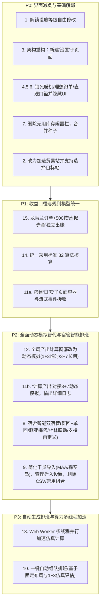

# 基建收益预测终端（ArcIncCalc）功能重构与全动态模拟改造实施计划

本计划旨在对基建排班与收益预测系统进行全面重构与升级。核心目标是：**精简与分层 UI（主工作台/设置/日志三页面体系）、彻底淘汰旧版静态估算并全面统一为动态模拟引擎、实现宿舍智能双宿管编排、统一 82 收益核算与龙舌兰虚拟赤金模型、支持基于固定布局的一键自动组队排班，并引入 Web Worker 多线程加速**。

---

## 实施阶段与优先级规划

按照业务依赖链条与技术复杂度，15 项需求划分为以下 4 个渐进交付阶段：



---

## 用户确认事项 (User Review Required)

> [!IMPORTANT]
> **1. 82 算法的具体口径确认（第 14 项）**
> 当前系统中存在两种常见的“82”理解：
> - **A. 综合产出价值评分法（目前模拟器采用）**：`综合分 = EXP + 0.8 × 赤金价值 + 0.2 × 订单面值`；
> - **B. 243 / 252 经典无人机 8:2 资源配比流**：以 80% 无人机加速贸易跑单、20% 加速赤金制造实现金币平衡。
> **默认建议**：按照选项 A 将最终报告中的“每日综合产出”评分与折算统一为 `EXP + 0.8×赤金 + 0.2×订单`，并在明细中完整列出各项原始数值。如您有特殊定义，请随时指出。

> [!IMPORTANT]
> **2. 龙舌兰“虚拟赤金”核算逻辑确认（第 15 项）**
> 当 3 级贸易站触发龙舌兰·β 技能时（订单交付数大于 3），龙门币收益增加 500，且不消耗实际仓库赤金。
> 我们将其定义为：**产出 1 件“虚拟赤金”**（等效价值 500 龙门币）。
> - 在产出统计表中，将新增一行/一列：`虚拟赤金（件）`，单独标注；
> - 在计算净赤金平衡时，虚拟赤金**不计入实体库存流转**，但**计入综合价值与等效龙门币产出**。

---

## 拟变动范围与实现方案

### 第一阶段（P0）：界面减负与基础解绑

#### [MODIFY] [FacilityEditor.vue](file:///d:/Project/Arknights/ArcIncCalc/src/components/workbench/FacilityEditor.vue)
- **解除设施等级锁定**：移除 `isLevelInferred` 对等级选择框的 `disabled` 限制。
- **动态容量同步**：用户修改任意房间等级（1/2/3）时，保持工位数同步调整（制造/贸易工位 = level，发电站 = 1）。
- **电量审核保障**：用户自由调整各设施等级后，界面实时根据所有房间等级和电站等级计算供需，只要总电量 `power.sufficient === true`（余量 >= 0），即可提交或计算。

#### [NEW] `src/components/workbench/SettingsModalOrView.vue` & [MODIFY] [WorkbenchShell.vue](file:///d:/Project/Arknights/ArcIncCalc/src/components/workbench/WorkbenchShell.vue)
- **三页面导航分层**：
  - 顶部导航栏增加：**「基建排班（主界面）」**、**「设置」**、**「日志」** 标签切换。
- **设置页面迁移承接**：
  - 将 `PolicyEditor.vue`（令夕模式、暖机名单、高频替补名单等）完整移入「设置」页面；
  - 将动态模拟的步长、随机种子、自定义模拟天数设置移入「设置」页面。
- **主界面瘦身**：
  - 主界面移除“策略配置”长面板；
  - 彻底删除“随机种子、无人机与可选库存设置”折叠栏；
  - 彻底删除“补充可入住宿舍的闲置干员”文本域；
  - 将随机种子（Seed）输入项合并进「设置」子页面中的模拟运行设置中。

#### [MODIFY] [policyFields.ts](file:///d:/Project/Arknights/ArcIncCalc/src/components/workbench/policyFields.ts) & 模拟配置默认值
- **第 4 项**：`warmupModel` 锁定为 `'hourly'`（整小时跳变），不再在任何 UI 呈现。
- **第 5 项**：`runOrderMode` 锁定为 `'drone'`（理想无人机跑单，零损耗），不再在 UI 呈现。
- **第 6 项**：`outputMode` 锁定为 `'potential'`（直观产出，忽略库存阻塞），不再在 UI 呈现。

#### [MODIFY] 无人机加速选项与目标选择（第 2 项）
- 将余量无人机策略从 `['gold', 'exp', 'none']` 重构为：
  - `gold`：加速赤金制造站
  - `exp`：加速作战记录制造站
  - `trading`：**加速贸易站**
- 当选择“加速贸易站”时，右侧联动显示**具体贸易站下拉框**（列出当前布局中所有的贸易站房间，如 `1号贸易站(B102)`、`2号贸易站(B202)` 等）。
- 引擎计算时，直接将余量无人机转化生产分钟数叠加至选定的目标贸易站中。

---

### 第二阶段（P1）：规则标准与收益口径对齐

#### [MODIFY] [calculate.ts](file:///d:/Project/Arknights/ArcIncCalc/src/engine/calculate.ts) & [types.ts](file:///d:/Project/Arknights/ArcIncCalc/src/domain/types.ts)
- **扩展 CalculationReport 模型**：
  ```ts
  export interface SummaryOutput {
    exp: number
    goldCount: number          // 实体赤金制造数
    goldValue: number
    virtualGoldCount: number   // 龙舌兰虚拟赤金数
    virtualGoldValue: number   // 虚拟赤金折算（*500）
    orderLmd: number
    fragments: number
    orundum: number
    goldConsumed: number
    netGoldCount: number       // goldCount - goldConsumed (不含虚拟赤金)
    totalScore82: number       // 82 算法综合得分
    totalEquivalentLmd: number
  }
  ```
- **龙舌兰跑单转换规则精准化**：
  - 贸易站处理龙舌兰触发的订单时，统计其增加的额外龙门币，并按每 500 龙门币折算为 1 个 `virtualGoldCount`；
  - 界面产出卡片及产出明细表中，以浅绿色徽章形式明确展示：`虚拟赤金（龙舌兰）：+N 件 (折合 500×N 龙门币)`。
- **统一 82 算法**：
  - 综合产出统一采用 `Score82 = exp + 0.8 * (goldValue + virtualGoldValue) + 0.2 * orderLmd`；
  - 产出卡片顶部突出显示 82 每日综合产出结论。

#### [NEW] `src/components/workbench/SimulationLogView.vue`
- **日志子页面**：
  - 具备事件流展示列表（换班时刻、心情耗尽、技能触发、订单完成、无人机充能等）；
  - 支持按设施筛选日志、搜索干员名称、清空日志及一键复制/导出日志。

---

### 第三阶段（P2）：全面动态模拟替代与宿管智能排班

#### [MODIFY] 引擎改造：全面动态模拟替代静态估算（第 11、12 项）
- 将 `D:\Project\Arknights\ArcIncCalc - Codex` 中已经验证的高精度动态模拟引擎组件集成到本工程：
  - `src/simulator/scheduleSimulation.ts`
  - `src/simulator/productionTimeline.ts`
  - `src/simulator/orderTimeline.ts`
  - `src/simulator/manufacturingTimeline.ts`
  - `src/simulator/mowerRunOrder.ts`
  - `src/engine/dormitoryRecovery.ts`
- **两级动态模拟规范**：
  1. **临时模拟（调试/组队初筛）**：预热 1 天 + 采样 3 天；
  2. **正式“计算产出”（代替旧运行模拟按钮）**：预热 3 天 + 采样 7 天；
  3. **长期模拟**：在设置子页面中支持自定义预热天数与采样天数。
- 点击主界面的 **“计算产出”** 按钮时：
  - 直接执行 3 天预热 + 7 天采样的动态模拟；
  - 计算完成后更新主界面的产出报告卡片；
  - 同时向「日志」子页面注入完整的全时序事件流。

#### [NEW] `src/scheduler/smartDormitoryPolicy.ts`（第 8 项：智能宿舍排班）
- **核心分配规则**：
  1. **双宿管默认架构**：每个宿舍（4个宿舍共8个名额）分配 2 名宿管干员：
     - **1 名群体回复干员**（恢复全宿舍干员心情，如杜林、流明、蜜莓、桃金娘等）；
     - **1 名单体回复干员**（单体加速，如褐果、阿米娅等）；
  2. **菲亚梅塔特殊规则**：检测到排班中有菲亚梅塔（`char_300_phenxi`）时，自动将其分配至**基础回复速率最慢**的宿舍中（优先享受充能与换班联动）；
  3. **非回复型技能联动干员（如杜林族联动）**：
     - 若该干员无心情回复技能：优先尝试入驻**加工站**或**训练室**；
     - 若该干员具有宿舍联动/回复技能：优先入住宿舍；
     - 若加工站/训练室均已占满：允许填入宿舍空位，但**不得超过排班表中最大组合的人数**限制；
  4. **手动覆盖与开关**：
     - 在宿舍编辑区域提供“禁用自动分配宿管”开关；
     - 开关开启后，完全由用户自由指定宿舍干员，自动排班与重排时绝不覆盖。

#### [MODIFY] 干员库导入与精简（第 9 项）
- 主界面工具栏新增统一的 **「导入干员库」** 下拉按钮，包含两个选项：
  1. **导入 MAA 识别结果**（上传/粘贴 MAA `copilot` 或 `storage.json` 中的干员信息）；
  2. **森空岛导入**（输入森空岛 Token 或导入抓取的数据，预留接口与解析桩）；
- 移除主界面的“我的干员库与组合准入”整块区域；
- 移除“导出 CSV”功能与“常用组合”展示区；
- 将干员练度查看列表及模拟时的干员库有效性核验移至「设置」子页面。

---

### 第四阶段（P3）：一键自动生成排班与多线程加速

#### [NEW] `src/optimizer/webWorkerPool.ts` & 集成 Worker（第 13 项）
- 引入 Web Worker 多线程并行机制（基于 `src/simulator/scheduleSimulationWorker.ts` 与 `src/optimizer/automaticRosterWorker.ts`）；
- 动态模拟的密集时序推演与组合打分完全移入后台线程执行，主 UI 线程通过 `postMessage` 接收进度与结果，确保界面始终保持 60 FPS 响应，无任何卡顿。

#### [MODIFY] 一键自动生成排班（第 10 项）
- 主界面工具栏提供醒目的 **「自动生成排班」** 单一按钮：
  - 点击后弹出轻量确认：清空当前房间干员分配，开始自动组队；
  - **严格保护用户布局**：**严禁修改**用户设定的设施等级与类型；
  - 生成算法采用“自动组队”策略，基于当前空布局，从可用干员库中生成候选组合；
  - 候选组合的优劣评价统一调用 **1 天预热 + 3 天采样** 的动态模拟评估；
  - 完成后直接将最优方案回填至主界面的 BaseMap 中；
  - 原“组合排班草案”面板迁移至「设置」子页面，供进阶用户查看中间候选草案。

---

## 验证与测试方案

### 1. 自动化单元测试与回归测试
- **设施等级与电量校验**：验证 252、243、333 布局自由修改等级时，电量充足时验证通过，电量不足时提示阻断。
- **龙舌兰虚拟赤金测试**：验证 3 级站触发 4 赤金订单时 +500 龙门币准确归为 1 份虚拟赤金，并在 summary 中正确统计。
- **82 算法一致性测试**：验证各类产物按照 `EXP + 0.8*赤金 + 0.2*订单` 计算公式的严格单调性与精度。
- **宿舍智能策略测试**：
  - 验证 4 个宿舍各自分配 1 群回 + 1 单回；
  - 验证菲亚梅塔处于最慢宿舍；
  - 验证杜林无回复干员优先入驻加工站/训练室；
  - 验证用户手动锁定后自动分配不覆盖。
- **动态模拟稳定性测试**：运行 1+3 天与 3+7 天仿真，验证无死锁、无异常负心情、产出收敛一致。

### 2. 交互与构建验证
- `vue-tsc -b` 零类型报错；
- `vite build` 生产打包成功；
- 页面切换流畅，在执行 3+7 模拟与自动组队时，主线程无冻结，日志能实时输出。
